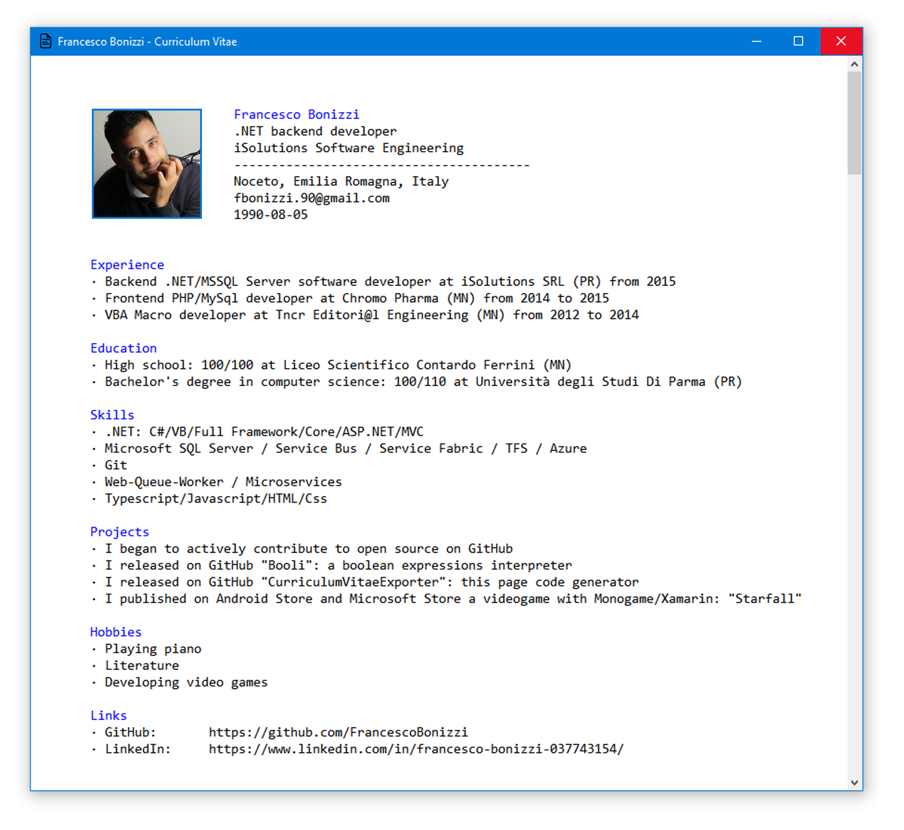

# CurriculumVitaeExporter

Just a library that defines a Curriculum Vitae domain and some abstractions to export it to any format.
Mine is exported as a Console Application with a fluent syntax!

# My Curriculum Vitae

- [Pdf version](FrancescoBonizziConsoleCurriculum/PublishedFiles/FrancescoBonizzi-CurriculumVitae.pdf)
- [Psd version](FrancescoBonizziConsoleCurriculum/PublishedFiles/FrancescoBonizzi-CurriculumVitae.psd)
- [Jpg version](FrancescoBonizziConsoleCurriculum/PublishedFiles/FrancescoBonizzi-CurriculumVitae.jpg)

# Building
Simply clone this repository and build the `CurriculumVitaeExporter.sln` solution.

# How to contribute
- Report any issues
- Propose new features / improvements, like implementing new `ICurriculumExporter` in other formats (`PDF`, `HTML`, `MD`...)
- Just telling your opinion :-)